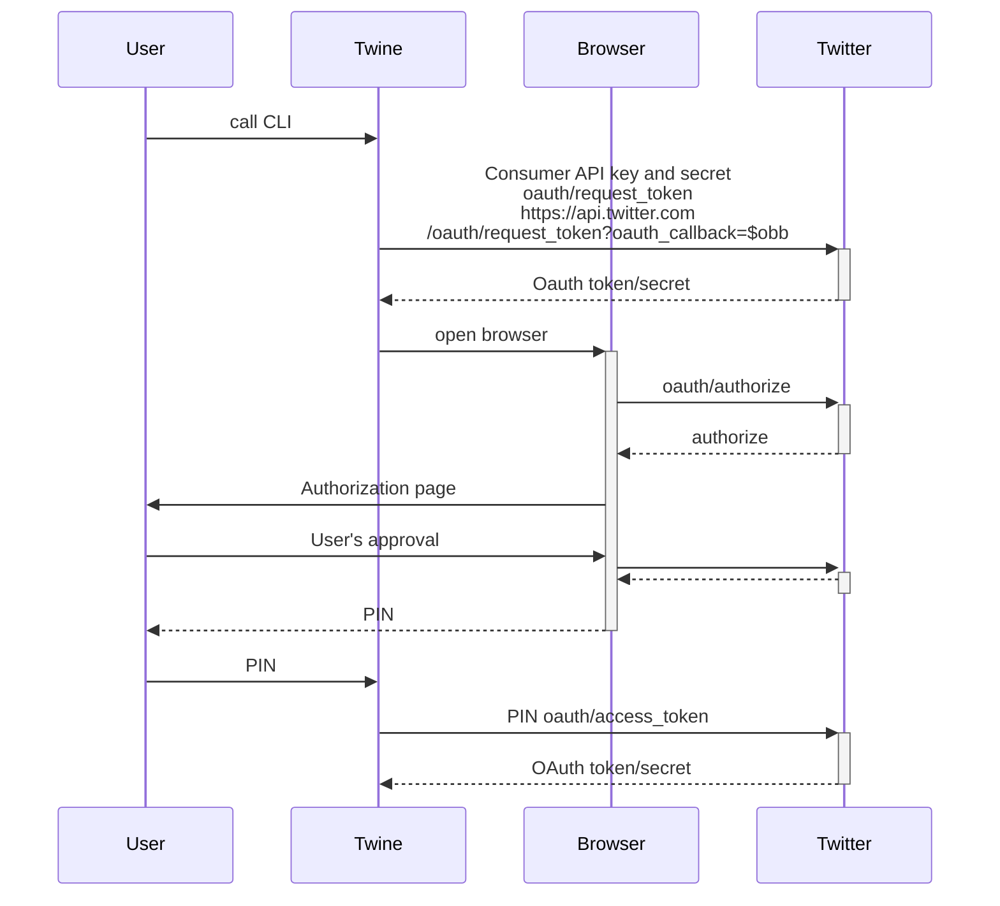

# twine

witter API
Pluralsight course to create Node.js CLI application using Twitter API
[Building Command Line Applications in Node.js 8](https://app.pluralsight.com/library/courses/node-js-building-command-line-app/table-of-contents)

Github [repository](https://github.com/pofallon/twine)

```
npm link 
npm link . 
npm unlink  
``````

C:\Users\userid\code\twine>more c:\Users\userid\.config\configstore\twine.json
```
{
        "apiKey": "1234",
        "apiSecret": "234345"
}
```

Unit tests:
* Test framework mochajs.org
* Assertion chaij.com
* Mock sinonjs.org


https://blog.logrocket.com/building-typescript-cli-node-js-commander/

<https://flaviocopes.com/book/read/node/>

package.json:

```shell

    "twine": "./bin/twine.js --experimental-json-modules"
```
npm [link](https://docs.npmjs.com/cli/v8/commands/npm-link)  

module [configstore](https://www.npmjs.com/package/configstore)
task switch to conf or to electron-store


Eslint init:
```
npm install --save-dev eslint
node_modules\.bin\eslint --init
```

```
C:\Users\antal\.config\configstore
❯ more twine.json

{
        "apiKey": "hello",
        "apiSecret": "1234"
}
```


dirty chai to accept
``` 
       expect(inquirer.prompt.calledOnce).to.be.true
       by eslint
```

store credentials in a secure way
* linux - libsecret
* macos - keychain
* windows - credential manager

in user accounts - credential manager - twine-test/foo

commander module for option parsing

/bin/tool.js -- program.command('read', 'a command to read')
-->
/bin/tool-read.js -- program.command('only', 'a sub command')
-->
/bin/tool-read-only.js -- program
. command('one)
. description('sub-sub-command')
.action(...)

nyc module - code coverage


package opn -- renamed to open





<https://developer.twitter.com/en/docs/authentication/oauth-1-0a>

```
curl --request POST \

  --url 'https://api.twitter.com/1.1/statuses/update.json?status=Hello%20world' \

  --header 'authorization: OAuth oauth_consumer_key="CONSUMER_API_KEY", oauth_nonce="OAUTH_NONCE", oauth_signature="OAUTH_SIGNATURE", oauth_signature_method="HMAC-SHA1", oauth_timestamp="OAUTH_TIMESTAMP", oauth_token="ACCESS_TOKEN", oauth_version="1.0"' \
```

---
  code: 'ERR_BAD_REQUEST',
  config: {

    headers: AxiosHeaders {
      Authorization: 'OAuth oauth_consumer_key="7m5CPb0Zh4Bk0bzhzK2wqBG3M", oauth_nonce="VxOE3yp9k0CHydjvdYIudjJD3OqEQEHx", oauth_signature="uVdWHLVzOEq0%2BCZG5KzvBL5mufo%3D", oauth_signature_method="HMAC-SHA1", oauth_timestamp="1689497801", oauth_version="1.0"',
      'Content-Type': 'application/x-www-form-urlencoded',
      'User-Agent': 'axios/1.3.3',
      'Accept-Encoding': 'gzip, compress, deflate, br'
    },
    baseURL: 'https://api.twitter.com',
    method: 'post',
    url: 'oauth/request_token',
    data: undefined
  },

---

[OAuth 1.0 - 6.1.1 Consumer Obtains a Request Token](https://oauth.net/core/1.0/#auth_step1)
```
To obtain a Request Token, the Consumer sends an HTTP request to the Service Provider’s Request Token URL. The Service Provider documentation specifies the HTTP method for this request, and HTTP POST is RECOMMENDED. The request MUST be signed and contains the following parameters:

oauth_consumer_key:
The Consumer Key.
oauth_signature_method:
The signature method the Consumer used to sign the request.
oauth_signature:
The signature as defined in Signing Requests.
oauth_timestamp:
As defined in Nonce and Timestamp.
oauth_nonce:
As defined in Nonce and Timestamp.
oauth_version:
OPTIONAL. If present, value MUST be 1.0 . Service Providers MUST assume the protocol version to be 1.0 if this parameter is not present. Service Providers’ response to non-1.0 value is left undefined.
Additional parameters:
Any additional parameters, as defined by the Service Provider.

```

<https://developer.twitter.com/en/docs/authentication/api-reference/request_token>

endpoint
https://api.twitter.com/oauth/request_token

curl --request POST \
  --url '<https://api.twitter.com/oauth/request_token?oauth_callback=$HTTP_ENCODED_CALLBACK_URL>' \
  --header 'Authorization: OAuth oauth_consumer_key="$oauth_consumer_key", oauth_nonce="$oauth_nonce", oauth_signature="oauth_signature", oauth_signature_method="HMAC-SHA1", oauth_timestamp="$timestamp", oauth_version="1.0"'


package.json

  //"type": "module",
  //"main": "index.js",

GET account/verify_credentials
<https://developer.twitter.com/en/docs/twitter-api/v1/accounts-and-users/manage-account-settings/api-reference/get-account-verify_credentials>

check application access:
<https://twitter.com/settings/connected_apps>

commands
/bin
/commands
/lib

previous error status
windows - echo %errorlevel%
linux - echo $?

console.log --> standard out
console.error --> standard error

Node
standard in process.stdin
standard out process.stdout
standard error process.stderr

streams
process.stdin.pipe(process.stdout)

### Tasks
- [ ] change from through2 to  Simplified Stream Construction,
- [ ] make nyc code coverage working
- [ ] tests for got
- [ ] change 'consumer' and 'account' to enum
- [ ] log level
- [ ] pipe
- [ ] replace got with axios

<https://developer.twitter.com/en/docs/authentication/guides/v2-authentication-mapping>


